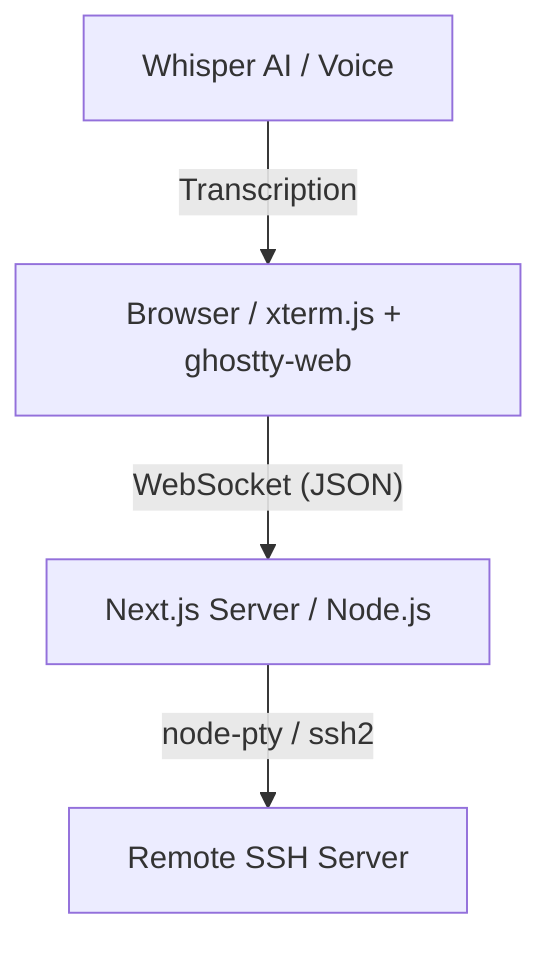

# WEB SSH GATEWAY

A high-performance, browser-based SSH terminal that allows you to connect to any remote server without installing a local client. Inspired by Termius, it offers a clean, tabbed interface for managing multiple simultaneous SSH sessions with full persistence.

## 🚀 Key Features

- **Multi-tab Sessions:** Connect to multiple servers and switch between them instantly.
- **Session Persistence:** SSH sessions remain alive on the server for 5 minutes after closing the browser tab.
- **AI Voice Input:** Integrated support for voice commands and transcription (via Whisper).
- **High-Fidelity Rendering:** Uses the `ghostty-web` WASM engine for fast, 256-color terminal emulation.
- **Secure Auth:** Supports both password and SSH key-based authentication.

## 🏗️ Technical Architecture



**High-Level Flow:**
```
[ User types 'ls' ] 
       │
[ Browser (ghostty-web) ] ────> [ WebSocket Message ] 
                                        │
                                [ Next.js Backend ] ────> [ ssh2 client ] ────> [ Remote Shell ]
                                                                                   │
[ Terminal Renders Output ] <──── [ WebSocket Message ] <──── [ stdout ] <─────────┘
```

## 🛠️ Tech Stack

- **Frontend:** Next.js, React, Tailwind CSS, ghostty-web (WASM)
- **Backend:** Node.js, WebSocket (`ws`), `ssh2`, `node-pty`
- **AI:** `@huggingface/transformers` (Whisper) for voice-to-text

## 🏃 How to Run

### Prerequisites
- Node.js 20+
- npm or yarn

### Installation
```bash
# Clone the repository
git clone https://github.com/pavandongare/web-ssh-gateway.git
cd web-ssh-gateway

# Install dependencies
npm install
```

### Development
```bash
# Run the development server
npm run dev
```

### Production
```bash
# Build the project
npm run build

# Start the server
npm run start
```

---
Built with ❤️ by [Pavan Dongare](https://github.com/pavandongare)
